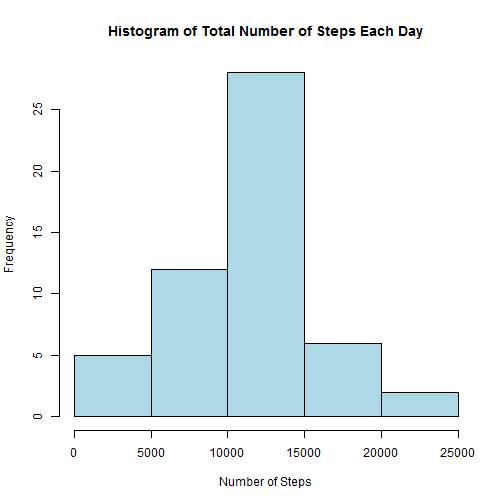

## R Markdown

This is an R Markdown document. Markdown is a simple formatting syntax for authoring HTML, PDF, and MS Word documents. For more details on using R Markdown see <http://rmarkdown.rstudio.com>.

When you click the **Knit** button a document will be generated that includes both content as well as the output of any embedded R code chunks within the document. You can embed an R code chunk like this:


```r
library(dplyr)
activitydata <- read.csv("activity.csv", sep = ",")
str(activitydata)
```

```
## 'data.frame':	17568 obs. of  3 variables:
##  $ steps   : int  NA NA NA NA NA NA NA NA NA NA ...
##  $ date    : Factor w/ 61 levels "2012-10-01","2012-10-02",..: 1 1 1 1 1 1 1 1 1 1 ...
##  $ interval: int  0 5 10 15 20 25 30 35 40 45 ...
```

```r
activitydata$date <- as.Date(activitydata$date)
activity <- activitydata %>% filter(complete.cases(activitydata))

head(activity)
```

```
##   steps       date interval
## 1     0 2012-10-02        0
## 2     0 2012-10-02        5
## 3     0 2012-10-02       10
## 4     0 2012-10-02       15
## 5     0 2012-10-02       20
## 6     0 2012-10-02       25
```

```r
totalsteps <- activity %>%
  group_by(date) %>%
  summarise(steps = sum(steps))
hist(totalsteps$steps, xlab = "Number of Steps", main = "Histogram of Total Number of Steps Each Day", col = 'light blue')
```


```r
mean(totalsteps$steps)
```

```
## [1] 10766.19
```

```r
median(totalsteps$steps)
```

```
## [1] 10765
```

```r
avgsteps <- activity %>%
  group_by(interval) %>%
  summarise(steps = mean(steps))
plot(avgsteps$interval, avgsteps$steps, type="l", xlab="Interval", ylab="Steps",main="Average Daily Number of Steps by Interval")
```


```r
avgsteps[which.max(avgsteps$steps),1]
```

```
## # A tibble: 1 × 1
##   interval
##      <int>
## 1      835
```

```r
sum(is.na(activitydata$steps))
```

```
## [1] 2304
```

```r
activityimputed <- activitydata %>%
  group_by(interval) %>%
  mutate(steps = replace(steps, is.na(steps), mean(steps, na.rm = TRUE)))
totalstepsimputed <- activityimputed %>%
  group_by(date) %>%
  summarise(steps = sum(steps))

head(totalstepsimputed)
```

```
## # A tibble: 6 × 2
##         date    steps
##       <date>    <dbl>
## 1 2012-10-01 10766.19
## 2 2012-10-02   126.00
## 3 2012-10-03 11352.00
## 4 2012-10-04 12116.00
## 5 2012-10-05 13294.00
## 6 2012-10-06 15420.00
```

```r
hist(totalstepsimputed$steps, xlab = "Number of Steps", main = "Histogram of Total Number of Steps Each Day", col = 'light blue')
```


```r
mean(totalstepsimputed$steps)
```

```
## [1] 10766.19
```

```r
median(totalstepsimputed$steps)
```

```
## [1] 10766.19
```

```r
mean(totalsteps$steps)
```

```
## [1] 10766.19
```

```r
median(totalsteps$steps)
```

```
## [1] 10765
```

```r
activityimputed["day"] <- weekdays(activityimputed$date)
activityimputed$type_day <- ifelse(activityimputed$day == "Saturday" | activityimputed$day == "Sunday", "Weekend", "Weekday")

## Turn type_day into a factor class
activityimputed$type_day <- as.factor(activityimputed$type_day)
avgstepstypeday <- activityimputed %>%
  group_by(type_day,interval) %>%
  summarise(steps = mean(steps))
library(ggplot2)

ggplot(data = avgstepstypeday, aes(x = interval, y = steps))+
  facet_grid(type_day ~ .)+
  geom_line()+
  ggtitle("Weekday vs. Weekend (Avg. Steps)")
```


## Including Plots

You can also embed plots, for example:



Note that the `echo = FALSE` parameter was added to the code chunk to prevent printing of the R code that generated the plot.
