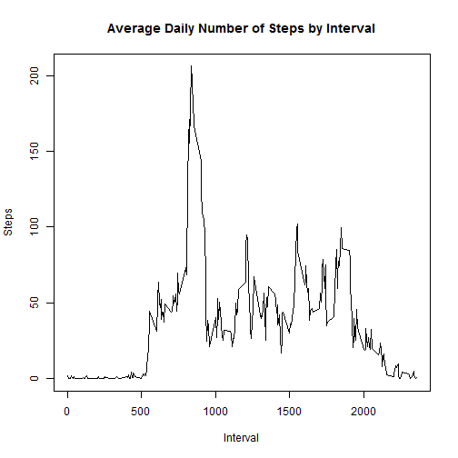
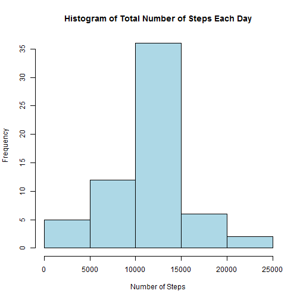
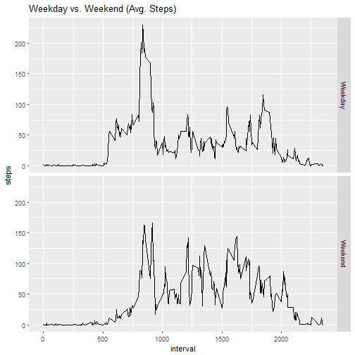

## About

This was the first assignment for the Reproducible Research course in Coursera's Data Science Specialization track.

The purpose of the project was to answer a series of questions using data collected from activity monitoring trackers such as FitBit, Nike Fuelband, or Jawbone Up. In this project, we practiced loading and processing data, plotting histograms and time series, and imputing missing values.

## Synopsis

It is now possible to collect a large amount of data about personal movement using activity monitoring devices such as a Fitbit, Nike Fuelband, or Jawbone Up. These type of devices are part of the "quantified self" movement - a group of enthusiasts who take measurements about themselves regularly to improve their health, to find patterns in their behavior, or because they are tech geeks. But these data remain under-utilized both because the raw data are hard to obtain and there is a lack of statistical methods and software for processing and interpreting the data.

This assignment makes use of data from a personal activity monitoring device. This device collects data at 5 minute intervals through out the day. The data consists of two months of data from an anonymous individual collected during the months of October and November, 2012 and include the number of steps taken in 5 minute intervals each day.
## preprocessing the data


```r
library(dplyr)
activitydata <- read.csv("activity.csv", sep = ",")
```
Now we need to view the structure of dataset.

```r
str(activitydata)
```

```
## 'data.frame':	17568 obs. of  3 variables:
##  $ steps   : int  NA NA NA NA NA NA NA NA NA NA ...
##  $ date    : Factor w/ 61 levels "2012-10-01","2012-10-02",..: 1 1 1 1 1 1 1 1 1 1 ...
##  $ interval: int  0 5 10 15 20 25 30 35 40 45 ...
```
Notice that the date is in factor class, so we need to change it to date format. We also need to filter out NA observations.

```r
activitydata$date <- as.Date(activitydata$date)
activity <- activitydata %>% filter(complete.cases(activitydata))
head(activity)
```

```
##   steps       date interval
## 1     0 2012-10-02        0
## 2     0 2012-10-02        5
## 3     0 2012-10-02       10
## 4     0 2012-10-02       15
## 5     0 2012-10-02       20
## 6     0 2012-10-02       25
```
## What is mean total number of steps taken per day?
For this part of the assignment, you can ignore the missing values in the dataset.

First we calculate the total sum of steps for each day.

```r
totalsteps <- activity %>%
  group_by(date) %>%
  summarise(steps = sum(steps))
```
Now we create the histogram based on the aggregated data.

                                                                             
                                                                             
Calculate and report the mean and median of the total number of steps taken per day

```r
mean(totalsteps$steps)
```

```
## [1] 10766.19
```

```r
median(totalsteps$steps)
```

```
## [1] 10765
```
The mean total number of steps taken per day is 1.076618910^{4}. The median total number of steps taken per day is 10765.

## What is the average daily activity pattern?
Calculate average steps for each interval for all days.

```r
avgsteps <- activity %>%
  group_by(interval) %>%
  summarise(steps = mean(steps))
```
Plot the Average Number Steps per Day by Interval.

Find interval with most average steps.

```r
avgsteps[which.max(avgsteps$steps),1]
```

```
## # A tibble: 1 × 1
##   interval
##      <int>
## 1      835
```
The interval with the most average steps is 835.

## Imputing missing values
Note that there are a number of days/intervals where there are missing values (coded as NA). The presence of missing days may introduce bias into some calculations or summaries of the data.

Calculate and report the total number of missing values in the dataset (i.e. the total number of rows with NAs).

```r
sum(is.na(activitydata$steps))
```

```
## [1] 2304
```
The number of rows with NA's is 2304.

Devise a strategy for filling in all of the missing values in the dataset. The strategy does not need to be sophisticated. For example, you could use the mean/median for that day, or the mean for that 5-minute interval, etc. Create a new dataset that is equal to the original dataset but with the missing data filled in.

I will be using the average steps of that 5-min interval to impute the missing values.

```r
activityimputed <- activitydata %>%
                    group_by(interval) %>%
                    mutate(steps = replace(steps, is.na(steps), mean(steps, na.rm = TRUE)))
```
Make a histogram of the total number of steps taken each day and Calculate and report the mean and median total number of steps taken per day. Do these values differ from the estimates from the first part of the assignment? What is the impact of imputing missing data on the estimates of the total daily number of steps?

Calculate the total number of steps taken each day with the imputed data.

```r
totalstepsimputed <- activityimputed %>%
                      group_by(date) %>%
                      summarise(steps = sum(steps))

head(totalstepsimputed)
```

```
## # A tibble: 6 × 2
##         date    steps
##       <date>    <dbl>
## 1 2012-10-01 10766.19
## 2 2012-10-02   126.00
## 3 2012-10-03 11352.00
## 4 2012-10-04 12116.00
## 5 2012-10-05 13294.00
## 6 2012-10-06 15420.00
```

Now we calculate the mean and median of the aggregated imputed data set.

```r
mean(totalstepsimputed$steps)
```

```
## [1] 10766.19
```

```r
median(totalstepsimputed$steps)
```

```
## [1] 10766.19
```
The mean and median of the imputed total steps taken per day is 10766.19.

Comparing the mean and median of the first part of assignment.

```r
mean(totalsteps$steps)
```

```
## [1] 10766.19
```

```r
median(totalsteps$steps)
```

```
## [1] 10765
```
The mean values between the two dataset are the same, but the median of the imputed dataset (10766.19) is higher than the median of the first part of assignment.

## Are there differences in activity patterns between weekdays and weekends?
For this part the weekdays() function may be of some help here. Use the dataset with the filled-in missing values for this part.

Create a new factor variable in the dataset with two levels - "weekday" and "weekend" indicating whether a given date is a weekday or weekend day.

```r
activityimputed["day"] <- weekdays(activityimputed$date)
activityimputed$type_day <- ifelse(activityimputed$day == "Saturday" | activityimputed$day == "Sunday", "Weekend", "Weekday")

## Turn type_day into a factor class
activityimputed$type_day <- as.factor(activityimputed$type_day)
```
Make a panel plot containing a time series plot (i.e. type = "l") of the 5-minute interval (x-axis) and the average number of steps taken, averaged across all weekday days or weekend days (y-axis). See the README file in the GitHub repository to see an example of what this plot should look like using simulated data.

```r
avgstepstypeday <- activityimputed %>%
                      group_by(type_day,interval) %>%
                      summarise(steps = mean(steps))

library(ggplot2)
```

```
## Warning: package 'ggplot2' was built under R version 3.3.3
```

```
## 
## Attaching package: 'ggplot2'
```

```
## The following object is masked _by_ '.GlobalEnv':
## 
##     diamonds
```



## Conclusion
There are some differences in average steps between Weekdays and Weekends. During weekdays, the person is more active at the start of the day and less active during the day. Meanwhile, during weekends, the person is less active at start of the day and more active throughout the day.

This is probably because the person is commuting to work in the morning and less active during work hours (sitting at desk). During weekends, the person does not have to prepare for work and therefore less active in the mornings, but more active during the day as the person is off from work.
